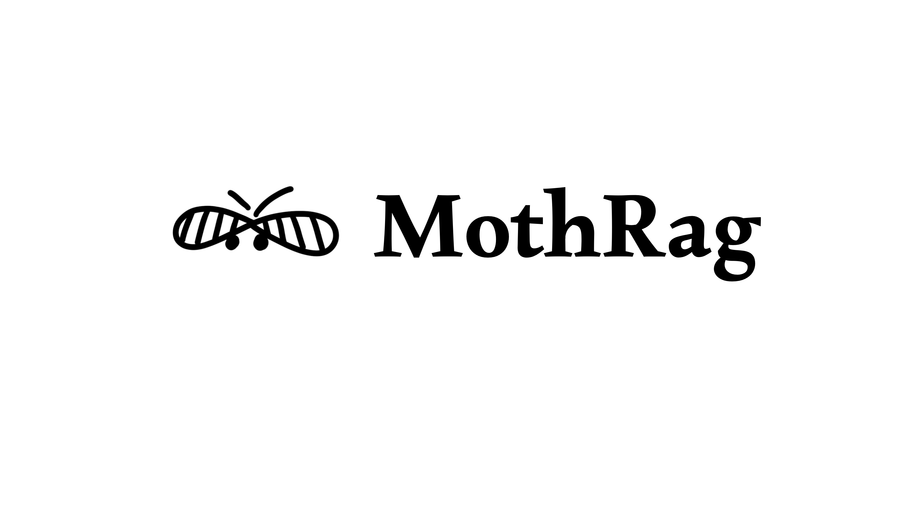

<p align="center">
  <picture>
    <source media="(prefers-color-scheme: dark)" srcset="assets/mothrag_logo_horizontal_dark.png">
    <source media="(prefers-color-scheme: light)" srcset="assets/mothrag_logo_horizontal_light.png">
    
  </picture>
</p>

# MOTHRAG

> **Deterministic, agentic-style multi-hop question answering at research-SOTA parity — on commodity LLM APIs alone. No GPU, no fine-tuning, a proof tree per answer.**

**Author:** Julian Geymonat · **Research supported by:** ItalySoft srl · **License:** Apache-2.0 · **Paper:** arXiv link pending · [Zenodo preprint DOI: 10.5281/zenodo.20668567](https://doi.org/10.5281/zenodo.20668567) · **Site:** [mothrag.com](https://mothrag.com)

Every component — reader, embedder, retrieval judges — sits behind a commodity pay-per-call API. No local GPU, no constrained decoding, no non-commercially-licensed model. Deployment is a package install plus API keys.

## Results (paper, n=1000 per dataset, Llama-3.3-70B reader, single uniform configuration)

| System | Deployment profile | HotpotQA | 2WikiMultiHopQA | MuSiQue | AVG |
|---|---|---|---|---|---|
| HippoRAG 2 (as published) | offline OpenIE graph + NV-Embed-v2 peak | 75.5 | 71.0 | 48.6 | 65.0 |
| CoRAG (training-based, as reproduced) | trained chain-retrieval | 75.1 | 75.1 | 52.9 | 67.7 |
| NeocorRAG (as published) | GPU-bound constrained decoding + NV-Embed-v2 | **78.3** | 76.1 | **52.6** | **69.0** |
| **MOTHRAG (ours)** | **commodity APIs only** | 78.1 | **76.3** | 50.5 | 68.3 |

F1, competitor numbers as published in the cited sources (same reader class). MOTHRAG attains the **highest average F1 among commercially-deployable frameworks** — within 0.7 points of the GPU-bound research state of the art (parity on HotpotQA at −0.2, an edge on 2WikiMultiHopQA at +0.2, an honest gap on MuSiQue at −2.1).

**Measured cost:** $0.032/query (reader + retrieval-judge, measured over 3,000 queries). A documented **economy tier** (one-flag retrieval-judge swap) runs at ≈$0.018/query (−44%) at statistical parity on HotpotQA and 2WikiMultiHopQA, with a measured trade-off only on MuSiQue (−2.12). All SOTA-parity claims attach to the full configuration.

Answers are **proof-tree-structured**: each output carries inspectable reasoning steps over the assembled evidence, with a γ-cap fallback when the grounding check cannot be satisfied within budget.

## Why deterministic?

Naive single-shot RAG is fading; the field is moving to *agentic* retrieval — planning, multi-hop iteration, reflection. MOTHRAG takes those mechanisms — query **decomposition**, **grounding-driven iteration**, **multi-hop** evidence chaining — but runs them through **deterministic** orchestration: same inputs → same answer, with an inspectable audit trail, instead of a flaky free-form agent loop.

We tested the alternative: letting an LLM route the pipeline. Every model we tried (Llama-3.3-70B, Claude Sonnet, Gemini Flash, Claude Haiku) did *worse* than the deterministic router. Determinism won on **accuracy and reproducibility** — which is exactly what you want when you put multi-hop retrieval into production or evaluate it cleanly.

## Install

```bash
pip install mothrag

# Recommended baseline (Gemini embeddings + Groq Llama-3.3-70B reader):
pip install 'mothrag[gemini,openai]'

# Full production stack:
pip install 'mothrag[prod]'
```

| Extra | Pulls | Used by |
|---|---|---|
| `gemini` | `google-genai` | `GeminiEmbedder`, `GeminiReader` |
| `openai` | `openai` | `OpenAIReader`, `GroqReader` (Groq's OpenAI-compatible API) |
| `sentence-transformers` | `sentence-transformers` | local embedding fallback |
| `retrieval` | `scikit-learn`, `networkx`, `rank-bm25` | classic-RAG features |
| `faiss` | `faiss-cpu` | vector store for 100k–10M chunk corpora |
| `prod` | bundles the above + loaders | full stack |

## Quickstart

```python
from mothrag import MothRAG

# Works out of the box (degrades gracefully without keys);
# set GROQ_API_KEY + GEMINI_API_KEY for production quality.
m = MothRAG.from_documents([
    "Paris is the capital of France.",
    "The Eiffel Tower is in Paris.",
])
result = m.query("In which country is the Eiffel Tower?")
print(result.answer)         # the answer
print(result.arm_used)       # which reasoning arm won arbitration
print(result.confidence)     # arbitration confidence
```

API keys via environment (see `.env.example`): `GROQ_API_KEY` (reader), `GEMINI_API_KEY` (embedder + grounding judge), `ANTHROPIC_API_KEY` (premium retrieval judge; optional — the economy tier uses Gemini).

## How it works

Three separable stages; every model invocation is a commodity API call:

1. **Bridge retrieval substrate** — multi-query ANN fusion re-ranked by a tripartite LLM judge conditioned on retrieved bridge evidence, reshaping every retrieval (primary, sub-question, iterative). A post-retrieval **ChainFilter** re-scores the ranking by chain density over OpenIE triples, gated by input features only.
2. **Four-arm ensemble pool** — direct read, decomposition, iterative refinement (γ-driven re-retrieval), and **Pool-Duplicate Dispatch (PDD)**: a deterministic copy of the iterative arm's candidate that double-weights the grounding-checked voice in arbitration at zero extra inference. Pool cardinality is fixed at N=4 (five-arm pools regressed consistently).
3. **Deterministic arbitration** — fixed weights over grounding status (γ, 1.0), cross-arm agreement (0.5), and faithfulness (0.3). No learned components anywhere; all gates condition on input features of the question, never on dataset identity.

## Reproducing the paper

The paper numbers come from the evaluation configuration (`scripts/route_prospective.py` with the full flag set), not from the high-level quickstart API. See **[`paper/REPRODUCE.md`](paper/REPRODUCE.md)** for the verbatim CLI, required inputs, and expected outputs. The per-query outputs behind every table in the paper are released in **[`paper/results/`](paper/results/)** (six JSONs: three datasets × premium/economy tiers, n=1000 each).

## Citing

See [`CITATION.cff`](CITATION.cff). Until the arXiv ID is live, cite the Zenodo preprint:

```bibtex
@misc{geymonat2026mothrag,
  title  = {MOTHRAG: Training-Free Multi-Hop Question Answering at Research-SOTA Parity on Commodity LLM APIs},
  author = {Geymonat, Julian},
  year   = {2026},
  doi    = {10.5281/zenodo.20668567},
  url    = {https://doi.org/10.5281/zenodo.20668567}
}
```

## License

Apache-2.0. © 2026 Julian Geymonat. Research supported by ItalySoft srl.
